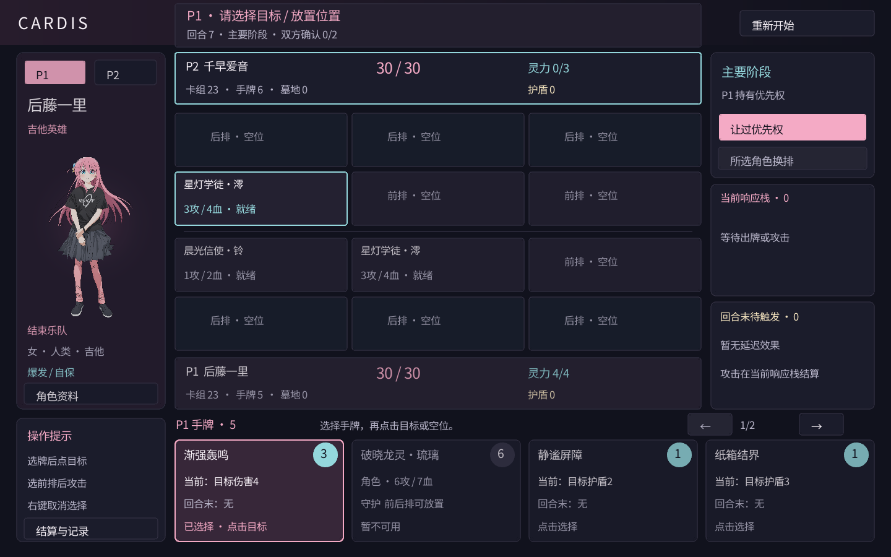

# Cardis

C++20 二次元卡牌对战原型，P1 后藤一里 / P2 千早爱音。**0.3 版本：操作聚焦、多段技能与回合交接提示。**
Cordis 管理服务生命周期，独立规则引擎处理阶段、优先权、结算栈与战斗。



## 本版内容

- 两套 30 张起始牌组，每套 15 种牌各两张；4 张起始手牌、洗牌、抽牌和墓地。
- 30 生命；己方回合灵力上限增加 1 并恢复，上限 10；对手回合保留余量用于响应。
- 主要 / 战斗 / 结束阶段；双方连续让过结算一个栈对象或推进阶段。
- 每人前排 3 格、后排 3 格，召唤、移动、攻击、反击、死亡与目标失效。
- 守护、疾奏、伤害、治疗、护盾。攻击进入结算栈，可用技能响应。
- 技能可包含多段“本次结算 / 回合末”效果；待触发列表与当前响应栈分别展示。
- “结算与记录”窗口可分页查看完整栈、待触发效果和对局记录，包括施放者、实际目标与触发回合。
- 高亮当前可操作的手牌、角色和目标；阶段提示、可跳过的 3 秒回合交接动效。
- 生命归零或需要抽牌时牌库为空判负；胜负提示和重开。
- 目标选择、分页手牌、行动提示、结算记录、角色资料和清晰中文字体。
- 固定种子重开；CLI 自动对战跑完整局；规则及资源校验测试。

这是玩法验证首版。装备、场地、羁绊/连携、属性克制、特殊胜利、组牌界面、换牌、AI 对手、联网和成长系统尚未实现。
CLI 的自动行动策略仅用于测试，不是桌面客户端的 AI。

## 构建运行

需要 Git、CMake 3.25+、C++20 编译器。Windows 使用 Visual Studio C++ 桌面工具链；首次配置会下载固定版本依赖。

```powershell
cmake -S . -B build/vs -A x64
cmake --build build/vs --config Release --parallel
ctest --test-dir build/vs -C Release --output-on-failure
.\build\vs\Release\cardis.exe
```

若命令不在 PATH，使用 Visual Studio Developer PowerShell。构建自动复制 assets 到可执行文件旁。
也可以显式选择源目录资源：

```powershell
.\build\vs\Release\cardis.exe assets/cards.json
.\build\vs\Release\cardis_cli.exe assets/cards.json
```

无窗口规则构建（不需要 OpenGL / X11）：

```sh
cmake --preset headless
cmake --build --preset headless
ctest --preset headless
```

Linux 桌面版需要 raylib / GLFW 的 OpenGL、X11 开发包。CI 配置包含 Windows 桌面与 Linux 无窗口构建。

## 操作与规则

两位玩家共用窗口，手牌区显示持有优先权玩家的手牌，适合一起测试规则，不提供隐藏手牌交接。

1. 主要阶段选择角色卡，再点击己方空位召唤；不能同时控制两张同名作品角色。
2. 选择技能，再点合法玩家或角色。伤害指向敌方，治疗和护盾指向己方。
3. 点击“让过优先权”交给对手；对手可响应。双方连续让过只结算栈顶一个对象。
4. 空栈双方让过进入战斗阶段。选择己方前排角色，再点敌方目标攻击。
5. 对方有前排时必须攻击前排；其中有守护时必须攻击守护。后排不能普通攻击，可在主要阶段移动到空的前排。
6. 新登场角色等待下个己方回合；疾奏允许立即攻击角色，但不能立即攻击玩家。移动每人每回合一次，使角色疲劳。
7. 角色战斗同时造成伤害。防守者即使疲劳也会反击。伤害持续保留，可用治疗恢复；护盾持续到被消耗。
8. 结束阶段后切换玩家，增加并恢复灵力、角色恢复就绪、抽一张牌。先手第一回合不额外抽牌。抽到最后一张不会输，下次需要抽牌时才判负。

**攻击不统一拖到回合结束。** 它在战斗阶段声明，双方响应结束后结算伤害；技能的“本次结算”段同样在响应结束后生效，不是点击就生效。
“回合末”段在原技能结算时登记，进入结束阶段后成为独立的栈对象，仍可响应。
例如失真独奏先造成 2 点伤害，回合末再造成 1 点；安可笑容先治疗 1 点，回合末获得 1 点护盾。
已经进入结束阶段后新登记的延时效果，顺延到下一个回合的结束阶段，不会在当前结束阶段无限重复触发。

回合切换显示 3 → 2 → 1 交接提示，可按空格或点击跳过。倒计时仅控制展示，不会替玩家让过、不自动发动攻击，也不是限时强制结束回合。

治疗不能超过最大生命。手牌上限 8：本版结束时自动从最右侧弃置超额牌。
起始牌组、自动弃牌与固定种子是首版简化。目标结算前离场会使对应效果失效，已支付费用不返还。

## 技术选型

| 第三方库 | 固定版本 | 用途 | 许可 |
|---|---|---|---|
| [Cordis C++](https://github.com/luoyebai/cordis-cpp) | 8eba297c535894ebe9b924ecb5e1046c0963d960 | 插件与服务生命周期 | README 声明 MIT，该提交无独立 LICENSE |
| [raylib](https://www.raylib.com/) | 5.5 | 窗口、绘制、输入、图片与字体 | zlib |
| [raygui](https://github.com/raysan5/raygui) | 4.0 | 按钮与基础控件 | zlib |
| [nlohmann/json](https://json.nlohmann.me/) | 3.12.0 | 卡牌和角色清单 | MIT |

规则核心只依赖 C++20 标准库；本轮没有增加第三方库。版本锁定见 cmake/Dependencies.cmake，完整说明见 [THIRD_PARTY.md](THIRD_PARTY.md)。

## 内容与代码

assets/cards.json 定义卡牌数值与类型；assets/characters.json 定义角色资料、技能归属、初始生命与灵力最终上限。
空 character_id 为通用卡；起始牌组由所有通用卡及本角色专属卡构成，每种两张，必须恰好 30 张。
新增中文文案后执行 tools/update_glyphs.ps1。字体遵循 SIL OFL；立绘来源见 [assets/SOURCES.md](assets/SOURCES.md)，图片权利仍归原权利人。

遵循[指定 C++ 代码规范](https://luoyebai.github.io/posts/cpp-python-code-style/)：类型大驼峰、成员函数小驼峰、全局函数大驼峰、变量 snake_case、私有成员后缀 _、枚举全大写、RAII、自包含 .hpp。

- src/core / include/cardis/core：权威规则状态及命令校验。
- src/content：JSON 加载；src/runtime：Cordis 服务适配。
- apps/client：桌面界面；apps/cli：有步数上限的完整对战模拟。
- tests：规则、角色、清单与服务生命周期测试。

详见 [架构](docs/architecture.md)、[角色配置](docs/characters.md)、[资源字段](assets/README.md)。
